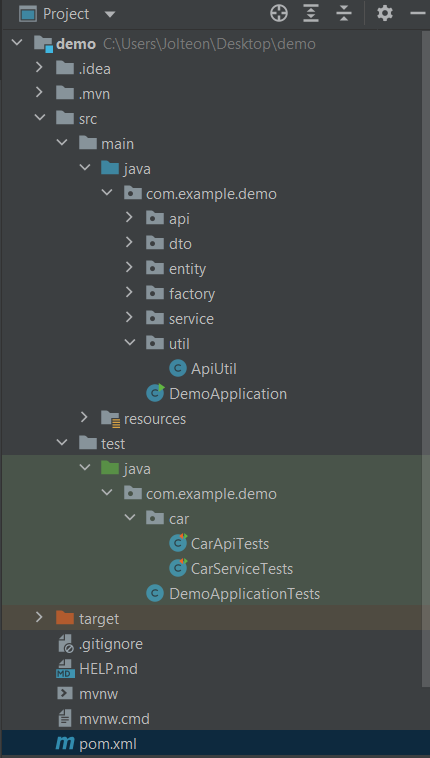

# GENERAL SUMMARY

### Getting Started or Question

In this problem, you are given an interface Car. 
There are three classes Cabrio, Sedan and Hatchback which implement
the Car interface, and they all contain a method getType().

```
interface Car {
    public String getType();
}
```
Create a spring boot project and then, publish a rest controller. 
Your controller method returns sample output by given input.

Please, write Readme.md document and postman collection example to call this service.

Unit tests will be evaluated as a plus.

Sample Input 1
```
cabrio
```
Sample Output 1
```
Cabrio Car has produced.
```
Sample Input 2
```
sedan
```
Sample Output 2
```
Sedan Car has produced.
```
# SPRING BOOT SAMPLE APP FOR THİS QUESTION
Minimal Spring Boot sample app.

### Requirements
For building and running the application you need:
```
JDK 1.8
Spring boot maven plugin or Maven 3.5
```
### Running the application locally
There are several ways to run a Spring Boot application on your local machine. 
One way is to execute the main method in the de.codecentric.springbootsample.Application class from your IDE.

Alternatively you can use the Spring Boot Maven plugin like so:
```
mvn spring-boot:run
```
## Spring-boot application - Integration-testing
This demo project exaplins how JUnit and jupiter test framework based integration-tests 
for a spring-boot application can make everyone's life easy everyday.

### Needed maven dependencies

```
    <dependency>
        <groupId>org.junit.jupiter</groupId>
        <artifactId>junit-jupiter-engine</artifactId>
        <version>5.3.2</version>
        <scope>test</scope>
    </dependency>
```
Where are the Unit tests?



The Unit tests are located under

    test/java/com/example/demo/car/CarApiTests
    test/java/com/example/demo/car/CarServiceTests

You can run and debug them individually.

### Postman Collection
if you want You can reach postman collection.

    src/main/resources/postman-collection/Vodafone.postman_collection.json
